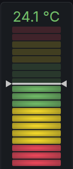

# Bar Gauge Setpoint

Custom Grafana panel plugin based on the original Grafana `BarGauge` with one extra feature: a setpoint marker for vertical retro LCD gauges.



The plugin keeps the stock Grafana LCD rendering and adds:

- left and right marker arrows
- a horizontal setpoint line
- configurable marker size
- configurable marker color with default `#ffffff`
- support for a second query used as the setpoint value

## Use case

This plugin is useful when you want to show:

- the current measured value as a vertical LCD bar
- the target or setpoint value as a marker across the bar

Typical examples:

- room temperature vs target temperature
- humidity vs desired humidity
- tank level vs warning threshold

## How it works

- The main value is taken from the first numeric query except the query selected as the setpoint query.
- The setpoint value is taken from the query refId configured in `Setpoint query refId`.
- The gauge rendering itself uses the original Grafana `BarGauge` component.
- The setpoint marker is drawn as an overlay on top of the gauge.

## Panel options

- `Display name`
  The label shown below the vertical gauge.
- `Min`
  Minimum gauge value.
- `Max`
  Maximum gauge value.
- `Unit suffix`
  Text appended to the displayed value, for example ` °C` or ` %`.
- `Setpoint query refId`
  Query refId used as the setpoint source, typically `B`.
- `Show setpoint`
  Enables or disables the marker overlay.
- `Setpoint color`
  Marker line and arrow color. Default is white.
- `Setpoint marker size`
  Scale factor for arrows and line thickness. `1.0` is the base size.
- `Thresholds`
  Comma-separated threshold definition, for example:

```text
red:17,yellow:19,green:22,yellow:26,red:28
```

## Example setup

### Queries

Use two queries:

- `A`
  Current measured value
- `B`
  Setpoint value

For example:

- `A` = `sensor.temperature`
- `B` = `input_number.lr_target_temperature`

### Panel configuration

- `Display name`: `Obývák-teplota`
- `Min`: `17`
- `Max`: `30`
- `Unit suffix`: ` °C`
- `Setpoint query refId`: `B`
- `Show setpoint`: `on`
- `Setpoint color`: `#ffffff`
- `Setpoint marker size`: `2.5`
- `Thresholds`: `red:17,yellow:19,green:22,yellow:26,red:28`

## Development

Install dependencies:

```bash
npm install
```

Run typecheck:

```bash
npm run typecheck
```

Build production bundle:

```bash
npm run build
```

## Home Assistant Grafana add-on

This plugin can be loaded into the Home Assistant Grafana add-on through `custom_plugins`.

Example add-on option:

```yaml
custom_plugins:
  - name: janbenes-bargaugesetpoint-panel
    url: https://github.com/jbrepogmailcom/janbenes-bargaugesetpoint-panel/releases/download/v1.0.9/janbenes-bargaugesetpoint-panel-1.0.9.zip
    unsigned: true
```

After changing the add-on configuration, restart the Grafana add-on.

## Repository

GitHub:

`https://github.com/jbrepogmailcom/janbenes-bargaugesetpoint-panel`
